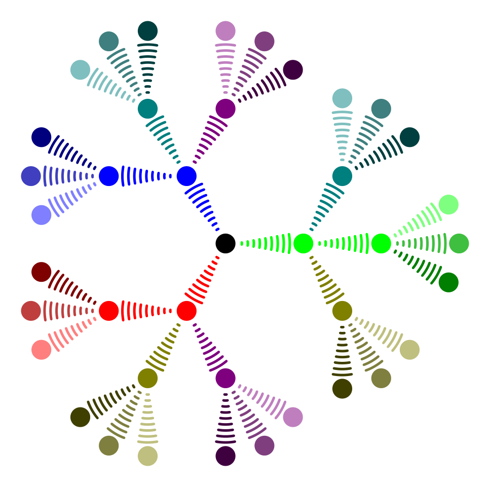

# LaTeX-TikZ

📚 This is a repository for storing and sharing **LaTeX-TikZ**  and **PGFPlots** pictures.

## Usage

```sh
# clone the repo
$ git clone https://github.com/TruongNhanNguyen/LaTeX-TikZ.git
# navigate to specify folder
$ cd <folder-name>
# example
# cd TikZ/GitHubProfilePicture
# compile .tex to .pdf
$ pdflatex main.tex
```

## My Github Profile Picture



```latex
\documentclass[tikz, border=10pt]{standalone}

\usepackage{tikz}
\usetikzlibrary{trees, snakes}
\usepackage{xcolor}

\tikzset{
    level 1/.style = {sibling angle=120},
    level 2/.style = {sibling angle=60},
    level 3/.style = {sibling angle=30},
    every node/.style = {fill},
    edge from parent/.style = {snake=expanding waves, segment length=1mm, segment angle=10, very thick, draw}
}

\begin{document}
    \begin{tikzpicture}[grow cyclic, shape=circle, level distance=13mm ,cap=round]
        \node {} child [color=\A] foreach \A in {red, green, blue} {
            node{} child [color=\A!50!\B] foreach \B in {red, green, blue}{
                node{} child[color=\A!50!\B!50!\C] foreach \C in {black, gray, white}{
                    node{}
                }
            }
        };
    \end{tikzpicture}
\end{document}
```

## Language and Tools

[](https://www.microsoft.com/en-us/windows?r=1)
[](https://git-scm.com/)
[](https://github.com)
[](https://code.visualstudio.com/)
[](https://tug.org/texlive/)
[](https://marketplace.visualstudio.com/items?itemName=James-Yu.latex-workshop)

## My LaTeX Workshop extensions `.config`

I placed all settings of **LaTeX Workshop** ext here
[`latex-workshop.json`](.config/latex-workshop.json)
